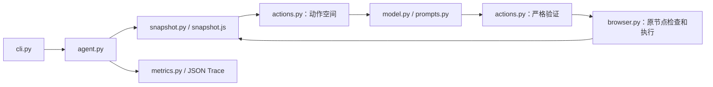

# DOMPilot

### A small browser agent for learning structured actions

**Explore a browser agent one step at a time: inspect numbered DOM snapshots, try manual or model-selected actions, and follow each decision, result, and timing in a local JSON trace.**

**从人工操作编号元素到模型选择受约束动作，逐步理解浏览器 Agent 的工作方式；通过本地 JSON Trace 查看每一步的输入、决策、结果与耗时。**

For learning and authorized, low-risk experiments. The offline demo uses local test pages and a simulated model without an API key; it does not measure real model performance.

面向学习及授权范围内的低风险实验。离线演示使用本地测试页面与模拟模型，无需 API Key，不代表真实模型能力或性能。

[Offline demo / 离线演示](#安装与离线演示) · [Trace example / 轨迹示例](examples/trace.search.json) · [Scope and limits / 范围与限制](#教学范围与上游借鉴)

## 安装与离线演示

需要 Python 3.11+ 和 uv。以下命令从源码根目录运行：

```console
uv sync --locked --python 3.12
uv run playwright install chromium
uv run dompilot --help
uv run python -m benchmarks.run --mode fake --repeats 5
```

Linux 首次安装浏览器可用 `uv run playwright install --with-deps chromium`。
下载受限时，可显式设置 `DOMPILOT_BROWSER_CHANNEL=chrome` 或 `msedge` 使用已安装浏览器。
仍然创建全新 Context，不连接已有窗口、不读取个人 profile。

默认 benchmark **不需要 API Key**：临时站点只监听 `127.0.0.1`，执行搜索、表单、
下拉框、动态控件四项任务，各五次，通过独立 DOM 检查判断成功。
结果保存在 `runs/benchmark/summary.json`；FakeModel 根据当前名称和值选目标，
用于验证工程链路，不能代表真实模型能力或 LLM 延迟。

## 人工模式

在第一个终端启动测试页面：

```console
uv run python -m http.server 8000 --bind 127.0.0.1 --directory benchmarks/pages
```

在第二个终端启动浏览器：

```console
uv run dompilot manual --url http://127.0.0.1:8000/search.html
```

根据显示的实际编号操作（下面仅作示例，每轮都应阅读新快照）：

```text
TYPE_TEXT 1 "Transformer"
CLICK 2
DONE
```

`TYPE_TEXT 1 ""` 清空输入；`SELECT 3 "python"` 选择已提供的精确 option value。
其他动作是 `SCROLL_UP`、`SCROLL_DOWN`、`WAIT`、`BLOCKED`。命令不会交给 Shell 执行。

## 真实模型模式

PowerShell 示例：

```powershell
$env:DOMPILOT_BASE_URL = 'https://你的兼容服务/v1'
$env:DOMPILOT_API_KEY = '你的密钥'
$env:DOMPILOT_MODEL = '你的模型名称'
$env:DOMPILOT_OUTPUT_MODE = 'text'
uv run dompilot run --url http://127.0.0.1:8000/search.html --task '搜索 Transformer'
```

配置参考 `.env.example`，程序不自动加载 `.env`。Base URL 缺省为 OpenAI 的 `/v1` 地址；
模型名和 Key 必须指定。真实模型调用按服务计费，默认 benchmark 不调用外部模型。

- `text`：默认兼容模式，要求单个 JSON 对象，依靠本地严格验证。
- `json_schema`：按当前目标生成动态 Schema，要求服务支持严格输出子集；失败不静默降级。

CLI 支持 `--headless`、`--max-steps 20`、`--run-dir`。
可选模型实验：`uv run python -m benchmarks.run --mode real --repeats 5`。
Wikipedia 搜索可作手动兼容性实验，不属于离线演示的验证范围。

## 如何阅读核心代码



| 模块 | 阅读重点 |
|---|---|
| actions | 数据类型、动态合法目标、Schema、拒绝非法组合 |
| snapshot | 可见控件、简化命名、裁剪、真实节点引用 |
| browser | Context 生命周期、旧引用保护、固定动作 |
| model / prompts | 有限输入、兼容 API、页面数据与指令分离 |
| agent | 顺序循环、有界恢复、终止与可选验证 |
| metrics / cli | 明确计数、人工模式与模型模式 |

模型看到的状态类似 `[1] search — Search`、`[2] button — Search`，
并得到 `TYPE_TEXT targets: [1]`、`CLICK targets: [2]`。输出例如：

```json
{
  "snapshot_id": "本轮实际的标识",
  "decision": {
    "action": "TYPE_TEXT",
    "target": 1,
    "text": "Transformer",
    "reason": "填写搜索框"
  }
}
```

TYPE_TEXT 覆盖填写；SELECT 接受精确选项值；滚动约为视口的 80%；WAIT 等待 500ms。
每轮只允许一个动作，模型没有选择器、坐标、JS 或 Shell 入口。

## 核心原理与限制

**为什么压缩网页？** HTML 包含大量无关布局、脚本和重复信息。这里最多提供 50 个
viewport 内控件，名称 120 字符，值/上下文各 200 字符，选项每控件 20 个、全页 100 个，
反馈文本 1000 字符。状态加动作列表限制 12,000 字符，完整 messages/Schema 限制
32,000 字符；历史保留最近五步。字符预算不冒充精确 token 数。裁剪删除完整记录，
再同步生成动作空间。简化命名按 ARIA、label、文本、placeholder/title 取值。

**编号为什么减少幻觉？** 模型只能选实际观察到的目标，不能猜 CSS/XPath；
但合法编号仍可能不符合任务意图，因此需要执行检查与独立验证。

**旧引用为什么失效？** 编号只属于一轮 Snapshot，页面会导航或替换节点。
Executor 保存当时的真实节点，并重检连接、可用性与关键属性；失效就重新观察，
不会在新页面按相同位置寻找替代节点。检查与执行不是原子事务。

**为什么分离决策和执行？** 模型给建议，Pydantic 验证格式，Action Space 验证组合，
Executor 验证实际节点。非法 JSON、字符串编号、额外字段、过期编号和未提供选项
不会直接触发浏览器动作；页面文字是观察数据，不能扩充工具能力。

**DONE 等于成功吗？** 普通运行返回 `done_unverified`，仅说明模型认为完成。
可信调用方可传入 `verifier(page) -> passed | failed | unknown`；benchmark
用真实 DOM/URL 验证，得到 `verified_success` 或 `verification_failed`。
模型不能编写验证函数。

**什么时候停止？** 默认最多 20 次决策尝试（失败也计入）、连续失败 3 次、连续
WAIT 3 次、同动作且无进展 3 次，或总预算 180 秒。模型/导航/动作超时为 30/15/3 秒，
Playwright/SDK 支持的超时参数受剩余预算约束。SDK 不隐藏重试；动作超时可能已经生效，先重观察再决定。
关闭/断开会退出；已识别的挑战和不支持的交互会 BLOCKED。

总时限是**协作式预算**：各阶段返回后检查时间并停止后续动作。同步 Playwright 的
DOM 求值、卡死的网页脚本和自定义 Verifier 无法由该预算强制中断；本版没有额外的
进程看门狗。Verifier 超时返回后会保留验证真值，但运行状态为 `stopped`，不会报告成功。

**怎样衡量效率？** 分开看任务真值、步骤、动作、无效决策、输入大小、模型耗时、
观察/动作/等待耗时与总耗时；不同机器或模型不设统一绝对延迟门槛。

## Trace、离线基准与退出状态

Trace 位于 `runs/run_<UTC时间>_<短ID>.json`，`trace_version=1`。逐步保存输入快照、
动作理由、目标、结果、错误及耗时，执行事实先落盘。初始导航单独计时，
DONE/BLOCKED 不计浏览器动作；FakeModel 实际 API 调用数为 0。
未知 token usage 为 `null`，使用完整性标志和已知部分区分缺失数据。
不保存密钥或请求头；Trace 包含任务和可见页面数据，默认保留在本地并被 Git 忽略。

[完整搜索 Trace 示例](examples/trace.search.json) 由本地 FakeModel 验收记录脱敏而来，包含三步：
填写 Transformer、点击 Search、DONE。前两步各执行一次浏览器动作，最后由独立
DOM Verifier 确认结果；API 调用为 0，token 为未知值。示例中的日期、端口、Snapshot
标识和机器版本已替换为固定示例值，耗时仅作阅读说明，不能用于性能比较。
真实运行的本地 Trace 会记录软件版本、浏览器版本、channel 与运行配置，便于复现实验。

```console
uv run ruff check .
uv run ruff format --check .
uv run python -m benchmarks.run --mode fake --repeats 5
```

离线 benchmark 只依赖本地 HTTP 演示页面与受控模型响应，运行搜索、表单、
下拉框和动态控件四项任务，并由独立 DOM 检查确认结果。运行记录只保存在本地
`runs/` 目录中。

退出码：0 为模型结束/验证成功（需同时查看 status）；1 为错误/验证失败；
2 为输入配置错误/BLOCKED；3 为运行保护停止；130 为用户中断。

## 教学范围与上游借鉴

定位为教育、授权范围内的低风险公开网页实验和本地测试。
仅支持主文档的普通控件、有限 ARIA button/link 和原生单选 select。
不支持视觉、Canvas、Shadow DOM、iframe 内操作、自定义复杂控件、上传下载、
多标签页、扩展、复杂键盘或获取登录态。没有 Cookie 导出、网络请求拦截、
漏洞扫描、认证绕过或任意代码执行接口。固定 DOM 提取脚本和网页自身 JS 可以运行。
挑战检测基于有限规则与模型判断，可能误报/漏报；遇到验证、CAPTCHA、安全挑战或
明确自动化禁令不会尝试绕过。这不是针对任意恶意网页的安全沙箱。

借鉴 [Jev Ultrafast](https://github.com/browser-use/jev-ultrafast) 的结构化状态、
临时编号、约束动作和低开销循环。上游使用 TypeSafe `questions/criteria` 与
Browser Harness/CDP；本项目独立采用 Playwright、Pydantic 和兼容 API，
不复制专用协议，不承诺上游延迟。参见
[上游模型实现](https://github.com/browser-use/jev-ultrafast/blob/main/jev_ultrafast/model.py)
与 [性能测量边界](https://github.com/browser-use/jev-ultrafast/blob/main/docs/performance.md)。
MVP 不引入多 Agent、RAG、MCP、长期记忆或复杂规划器。

模块契约、代码规模与验证范围见 [实施说明](docs/implementation.md)。
